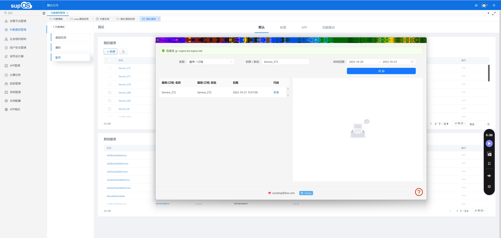

 

<h1 align="center">suoOS autosave chrome extension</h1>

 

<h4 align="center"> 帮助记录 脚本 / 可编程组件 / 服务 / 订阅 的历史提交记录</h4>

## 适用场景

- 当不小心覆盖了，脚本，可编程组件无法找回

## 页面效果

## 常见问题

- 数据保存在哪里

  <strong>IndexedDB</strong>, 通过 F12 打开开发者工具,点击 <strong> 应用/application </strong>标签, 在存储菜单中找到 IndexedDB,数据库的名字为 <strong> SupOS </strong>, 如果点击删除数据库数据将会丢失,并在下一次载入的时候新建数据库。

- 为什么插件不生效
  
  a. 确认当前 tab 页位 supOS 的页面， 其他平台页面无法链接成功
  b. 如果首次安装或更新了插件，需要刷新页面才能让插件生效
  c. 插件在 3.x 4.x 版本测试过， 如果其他版本有问题请联系我们

## 源码使用方式

1. 下载对应版本的 [Source code](https://github.com/supos-ai/autosave-chrome-extensions/releases) 解压
2. 浏览器打开 `开发者模式`
3. 加载解压后的文件夹

## License

suoOS autosave chrome extension is [MIT licensed](LICENSE).
